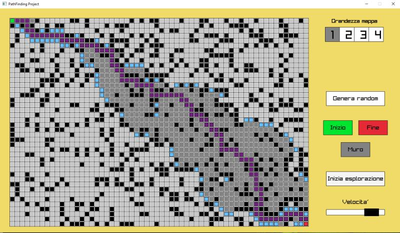

# A* Pathfinding Visualizer

An interactive visualizer for the **A\* (A-Star) pathfinding algorithm**, built in C++ using [Raylib](https://www.raylib.com/). Place a start point, an end point, and draw walls manually or generate them randomly — then watch the algorithm explore the grid and trace the shortest path in real time.



---

## Features

- **Real-time A\* visualization** — observe the exploration step by step as it happens
- **Interactive grid editing** — place the start point, end point, and walls with mouse clicks
- **Random maze generation** — instantly populate the grid with randomly placed walls (~25% density)
- **4 map sizes** — switch between different grid resolutions (sizes 1–4)
- **Adjustable exploration speed** — control how fast the algorithm steps through nodes via a slider
- **Path reconstruction** — once the destination is reached, the shortest path is traced back and highlighted
- **Multi-threaded** — the pathfinding runs on a separate thread, keeping the UI responsive at 60 FPS

---

## How It Works

The A\* algorithm searches for the shortest path between two nodes by evaluating each candidate node using the cost function:

```
f(n) = g(n) + h(n)
```

- **g(n)** — the actual cost from the start node to node `n`
- **h(n)** — a heuristic estimate of the cost from `n` to the end node (Euclidean distance × 1.5)
- **f(n)** — the total estimated cost; nodes with lower `f` are explored first via a min-priority queue

Neighbors are explored in 4 directions (up, right, down, left). When the destination is reached, the algorithm traces back through parent pointers to reconstruct and display the optimal path.

### Tile Color Legend

| Color | Meaning |
|-------|---------|
| Light Gray | Unexplored tile |
| Dark Gray | Explored tile (closed list) |
| Sky Blue | Listed tile (open list) |
| Dark Purple | Shortest path |
| Green | Start node |
| Red | End node |
| Black | Wall |

---

## Controls

| Action | Input |
|--------|-------|
| Select tile type (Start / End / Wall) | Click the corresponding button in the sidebar |
| Place a tile | Left-click on the grid |
| Remove a wall | Right-click on a wall tile |
| Generate random walls | Click **"Genera random"** |
| Start pathfinding | Click **"Inizia esplorazione"** |
| Change map size | Click **1 / 2 / 3 / 4** in the size selector |
| Adjust speed | Drag the speed slider |

---

## Building

### Prerequisites

- CMake ≥ 3.11
- A C++17-compatible compiler (GCC, Clang, or MSVC)
- Internet connection on first build (Raylib 5.5 is fetched automatically if not found locally)

### Steps

```bash
git clone https://github.com/your-username/PathFinding-Project.git
cd PathFinding-Project
mkdir build && cd build
cmake ..
cmake --build .
./raylib_game
```

> On **macOS**, the required frameworks (IOKit, Cocoa, OpenGL) are linked automatically by CMake.

---

## Project Structure

```
PathFinding-Project/
├── src/
│   └── main.cpp        # All application logic
├── images/
│   └── example.jpeg    # Screenshot
├── CMakeLists.txt
└── README.md
```

---

## Dependencies

- [Raylib 5.5](https://github.com/raysan5/raylib) — simple and easy-to-use library to enjoy videogames programming

---

## License

This project is open source. Feel free to use, modify, and distribute it.
